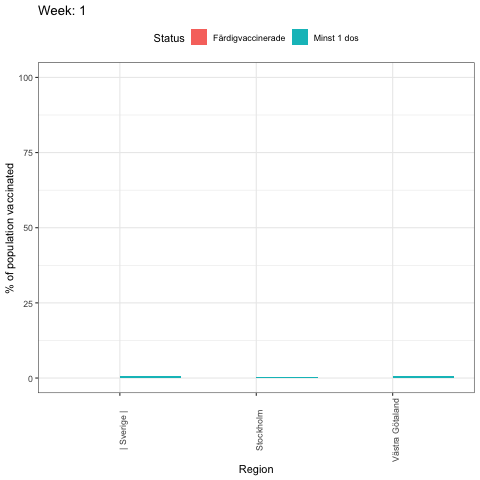

# Covid Sweden vaccination with gganimate in R
 
 R visualization code to plot dynamic charts of Sweden Vaccinations per Region and Date
 
 I have tested several times different types of visualization by using ggplot2, on my goal to animate them and compare different regions and ages or gender.

